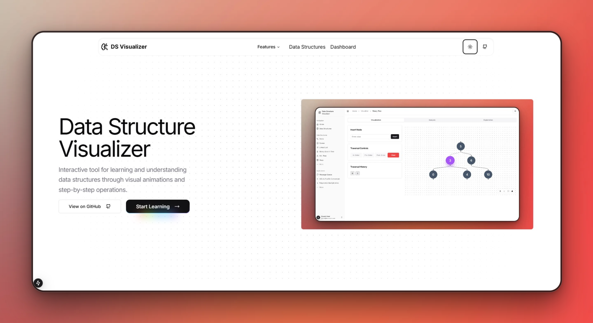
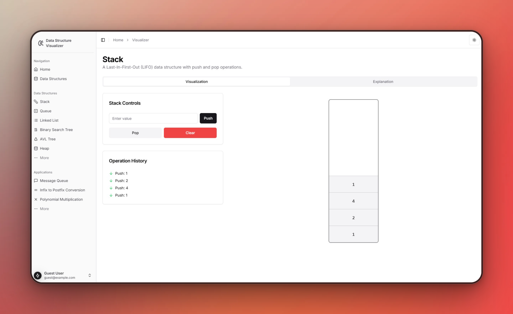
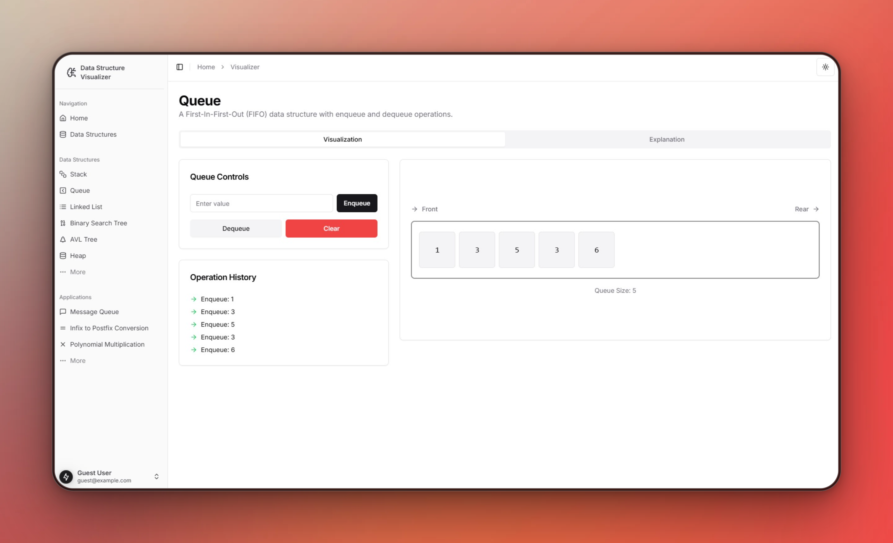
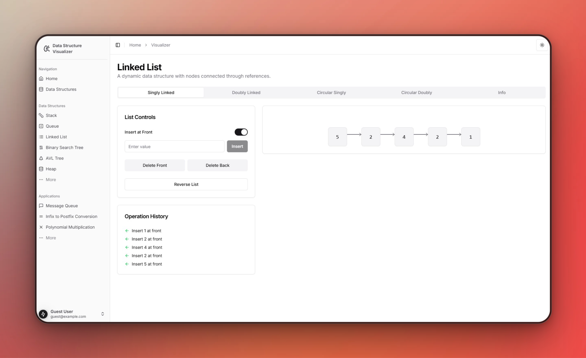
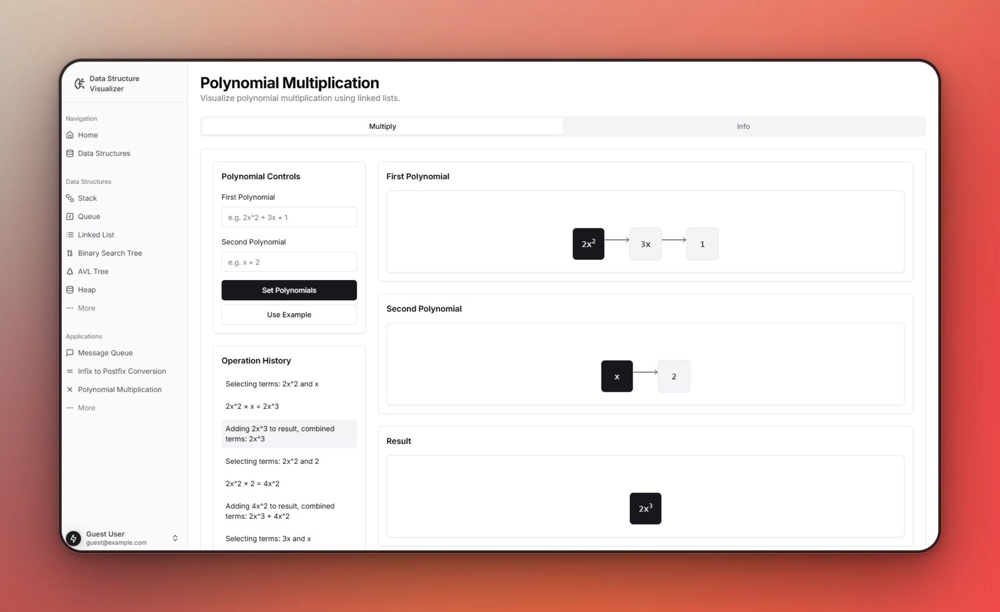
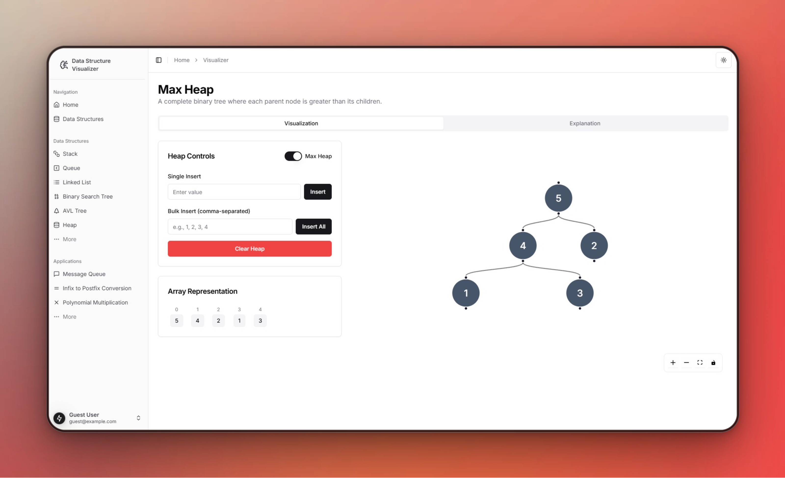
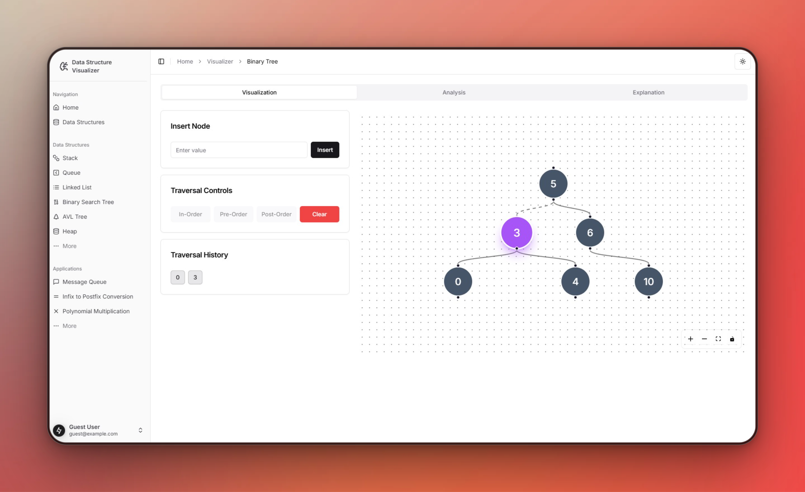
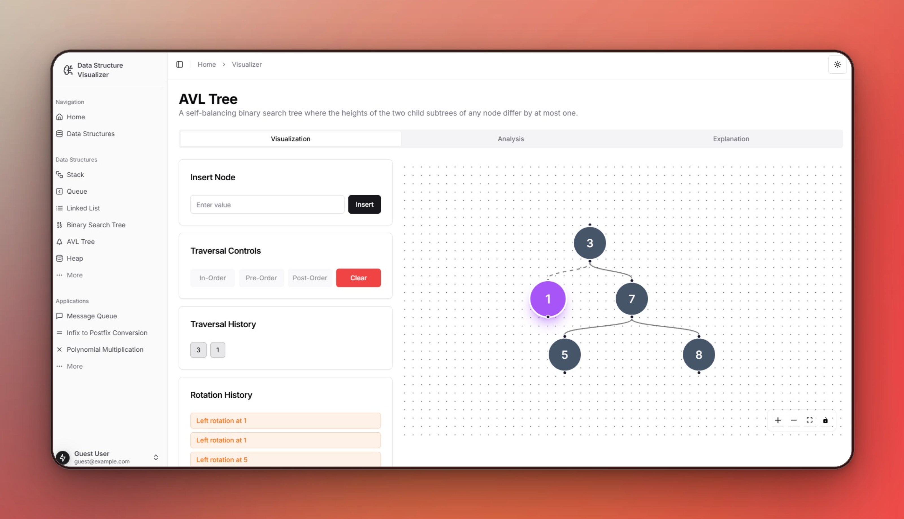
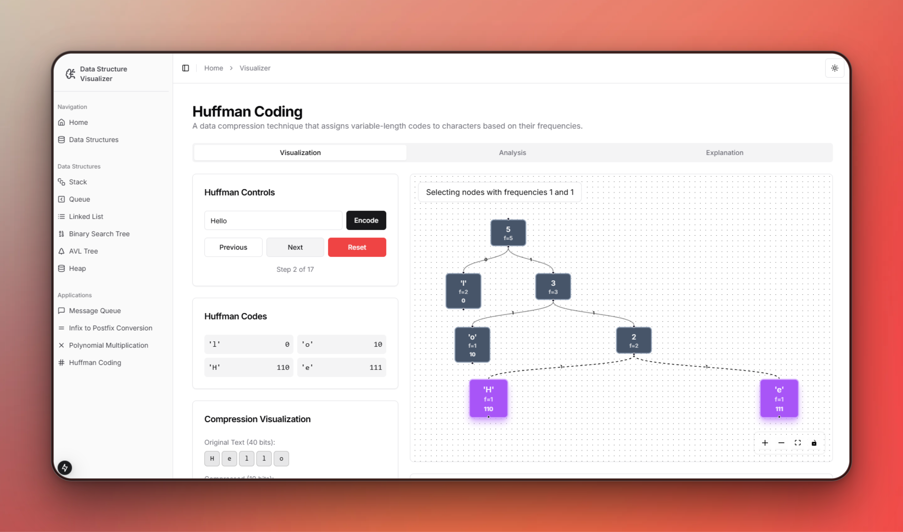
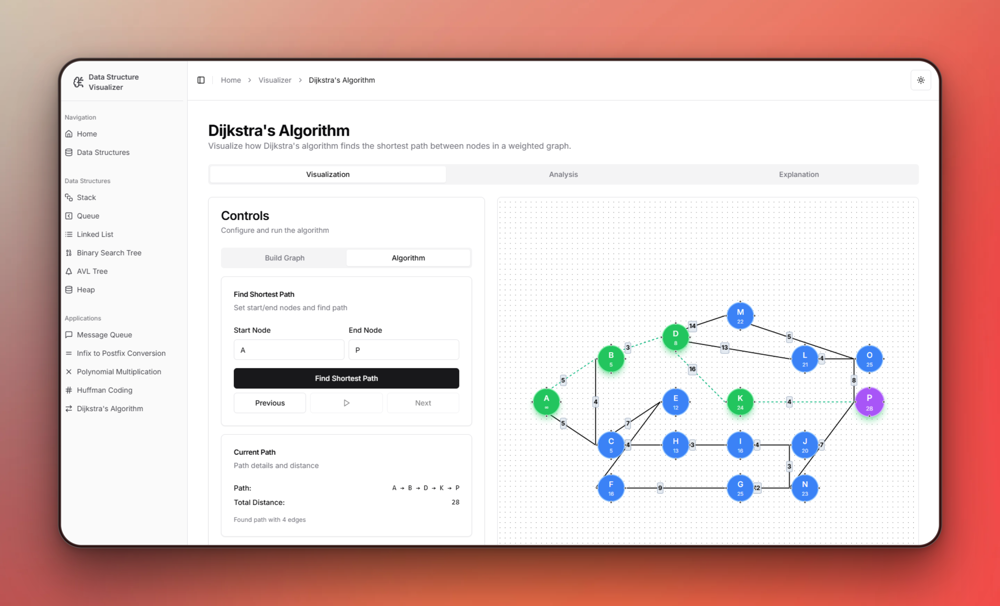

# Data Structure Visualizer

An interactive web application for learning data structures through visual animations and step-by-step operations. Built with Next.js 14, TypeScript, Shadcn/ui, React Flow and Framer Motion.












## Features

### Data Structures
- **Linked Lists**: Singly, doubly, and circular implementations
- **Stack & Queue**: LIFO/FIFO operations with visual feedback
- **Trees**: BST and AVL with auto-balancing visualizations
- **Heap**: Min/max heap implementations with heapify animations

### Applications
- **Infix to Postfix Conversion**: Expression conversion using stacks
- **Message Queue System**: Producer-consumer queue simulation
- **Polynomial Multiplication**: Using linked list representation
- **Huffman Coding**: Encoding and decoding messages using a Huffman tree
- **Dijkstra's Algorithm**: Finding the shortest path between nodes in a graph

## Tech Stack

- **Framework**: Next.js 15
- **Language**: TypeScript
- **Styling**: TailwindCSS
- **Animations**: Framer Motion
- **Graph Visualization**: React Flow
- **UI Components**: Shadcn/ui

## Getting Started

1. Clone the repository:
```bash
git clone https://github.com/CubeStar1/ds-visualizer.git
cd ds-visualizer
```

2. Install dependencies:
```bash
npm install
```

3. Run the development server:
```bash
npm run dev
```

4. Open [http://localhost:3000](http://localhost:3000) in your browser

## Project Structure

```
ds-visualizer/
├── app/                    # Next.js app router pages
├── components/            
│   ├── ui/                # shadcn/ui components
│   ├── visualizer/        # Data structure visualizations
│   ├── landing/           # Landing page components
│   └── global/            # Global components
├── hooks/                 # Custom React hooks
├── lib/                  
└── content/              # Markdown content for explanations
```


